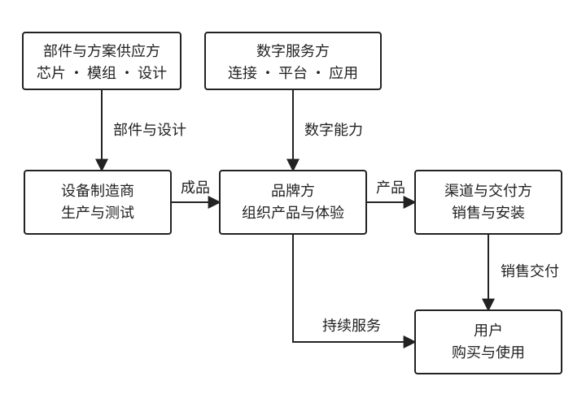

# 1.2 IoT 生态链上的角色与分工

[返回第 1 章：IoT 世界地图](../01-iot-world.md)

买一盏智能灯时，我们通常会看品牌、亮度、价格，以及它能用哪个 App 控制。包装盒上很少列出芯片来自谁、固件由谁开发、联网服务由谁提供。这些企业没有一起出现在货架上，却共同影响着这盏灯怎样被生产、销售和使用。

上一节界定了 IoT 的范围，并区分了设备、连接、平台和应用的工作。这一节把视线转向企业和人：谁提供部件，谁组织产品，谁完成销售与交付，又是谁在设备售出后继续承担服务责任。

本节先建立参与者和责任的地图。平台的供给方式、企业如何组合这些能力，以及服务变化后由谁承担后果，分别放到后面的主题讨论。

## 1.2.1 一件智能产品背后的行业地图

一件智能产品，看起来可能只是一个灯泡、一把门锁或一台扫地机器人，背后却往往连接着许多企业和服务。

假设一家名为“晴川”的虚构照明品牌准备推出一款智能灯。它首先要解决的是产品怎样被设计和生产：电路与固件可以由自己的团队开发，也可以采用方案商的成熟设计；产品可以在自有工厂生产，也可以委托专业制造商完成。灯具使用的芯片、无线模组和电源器件，则来自更上游的供应商。

硬件做出来以后，还要让“智能”能力持续运行。用户需要通过 App 添加设备、开关灯和调节亮度，设备还可能需要远程控制、软件升级与故障诊断。这些能力可以由晴川自行开发，也可以部分采购通信服务、云平台或第三方软件。

最后，产品还要真正到达用户手中。晴川可以通过官网和门店直接销售，也可以借助电商平台、零售商或经销商触达客户。简单的灯泡可能由用户自行安装，全屋智能照明则可能需要勘测、设计、安装、调试和后续维护。

因此，一盏智能灯从想法变成用户能够购买并长期使用的产品，大致涉及三组相互交织的工作：

- **产品与制造：**芯片、模组、方案和制造服务共同把产品设想变成可以批量交付的设备；
- **连接与数字服务：**网络、平台和应用让设备能够联网、被管理，并在售出后继续获得软件与服务支持；
- **销售与交付：**品牌、渠道、安装和服务团队把产品带到客户面前，并帮助它进入真实的家庭或项目环境。

品牌方要做的，是把这些分散的供给组织成一件用户能够理解、购买并持续使用的产品。

图 1-1 晴川智能灯的一种可能合作结构。箭头表示部件、成品或服务的提供方向，不表示设备之间的通信路径，也不一定代表付款方向。为了便于建立整体认识，图中的“数字服务”暂时把连接、平台和应用等能力放在一起，后文再分别展开。图中的角色可以由不同企业分别承担，也可以由同一家企业兼任。

### 这不是一条固定的流水线

“产业链”很容易让人联想到一条从上游到下游依次排列的直线，但现实中的 IoT 行业并没有这么整齐。

同一家制造商可以为多个品牌生产产品，同一个平台可以服务不同的设备企业，品牌也可以绕过经销商直接向消费者销售。有些企业甚至同时从事硬件研发、设备制造、平台运营、App 开发和售后服务。

因此，与其把 IoT 理解成一条固定链条，不如把它看成一张**协作网络**：不同企业各自提供一部分能力，再围绕具体产品、客户和项目重新组合。

同样是一盏智能灯，晴川可以大量采用外部供应商的成熟能力，也可以把更多产品研发与平台能力掌握在自己的团队中。最终产品看起来可能相似，背后的企业分工、成本结构和责任边界却可能完全不同。

### 先看它做什么，再看它叫什么

市场上经常出现“平台公司”“方案商”“设备厂商”“生态企业”和“解决方案提供商”等称呼，但这些名称并没有严格统一的边界。

一家公司可能既销售模组，又提供开发工具；既生产设备，又向其他品牌提供设计方案；既经营自己的消费品牌，又向合作伙伴开放平台能力。因此，**角色描述的是一家企业在某段合作关系中承担什么工作，而不是给整家公司贴上一个永久标签。**

面对一家陌生企业，与其先问“它究竟属于哪一类”，不如先问三个更具体的问题：

- 它向谁提供产品或服务？
- 它实际交付的是什么？
- 它替客户完成了哪些工作？

带着这三个问题，后面再看芯片、模组、方案商、制造商、品牌、平台和系统集成商，就会更容易理解它们之间的分工。接下来，我们先从最靠近设备底层的芯片、模组和方案开始，逐步展开这张 IoT 行业地图。

## 1.2.2 芯片、模组与方案：谁让设备具备智能能力

一台智能设备为什么能计算、联网、感知环境，并按照程序运行？这些能力来自它内部的电子器件和运行的软件。芯片供应商、模组供应商和设备方案商，分别帮助设备厂商完成其中不同范围的工作。

可以先粗略地理解：芯片提供基础能力，模组把芯片及配套电路集成为功能部件，设备方案则围绕某一类产品，把电路、软件和开发资料等组织起来。继续用晴川智能灯的例子，就能看清它们分别帮设备厂商做到了哪一步。

### 芯片：提供最基础的能力

芯片是设备中的基础电子器件。有些负责运行程序，可以把它理解为设备里的“小电脑”；有些负责 Wi-Fi、蓝牙或蜂窝网络通信；还有些负责测量温度、光线、运动，或者管理设备的供电。一颗芯片也可能集成多种能力，例如同时运行控制程序并处理无线通信。

设备厂商会根据产品需要选择芯片，再围绕它们设计电路和软件。比如一盏智能灯，需要运行控制程序，让灯按要求开关或改变亮度；如果还要用手机控制它，就需要安排相应的通信能力。这些功能可以由不同芯片配合完成，也可以选用集成程度较高的芯片。

对设备厂商来说，选择芯片还意味着选择一套开发支持。芯片厂商通常会提供开发工具、示例程序和参考设计，帮助客户编写、调试软件，并把芯片用进实际产品。

乐鑫科技就是一个具体例子。它提供 ESP 系列芯片，以及模组、开发板和 ESP-IDF 软件开发框架。开发板把芯片和常用的配套电路放在一块电路板上，便于学习和试验；开发框架则提供编写设备程序所需的软件基础。许多读者见过的 ESP32 开发板，就属于这样的开发入口。[乐鑫产品与开发资源](https://www.espressif.com/en/products/modules)

理解这类供应商时，可以先记住：**它提供基础器件，也帮助客户把这些器件开发成能够工作的电路与程序。**

### 模组：把一部分复杂工作提前做好

直接使用芯片时，设备厂商往往还需要设计配套电路，并处理不少技术细节。模组把其中一部分工作提前完成，交付一个可以继续集成到产品中的功能部件。

以无线通信模组为例，除了芯片，它还可能包含存储器、时钟电路、处理无线信号的射频电路，以及天线或天线接口。具体集成了什么，要看模组型号；有些模组还配有现成的软件，方便设备程序调用其通信能力。

这有点像组装电脑时直接采购内存条：使用者不必从一颗颗存储芯片开始设计，但仍然要选择兼容的部件，并把它正确地装进整机。设备厂商采用通信模组，也需要按其要求安排供电、电路连接和软件配合，才能让模组在自己的产品中工作。

**使用模组，可以减少一部分底层开发工作，整机集成仍要继续完成。** 无线电路设计、软件适配和部分测试，可以由模组厂商预先处理；设备的结构、供电方式、天线位置以及整机测试，则仍需要结合具体产品完成。

移远通信可以用来理解这一类企业。它提供蜂窝通信模组、Wi-Fi/蓝牙模组、卫星定位模组，以及天线等相关产品。设备厂商采购这些模组，相当于把一部分通信或定位技术的集成工作交给专业供应商，再将这些功能部件用进自己的产品。[移远产品概览](https://developer.quectel.com/product-overview)

### 方案：离最终产品又近了一步

模组围绕一组功能进行集成，设备方案则进一步围绕某一类产品组织设计。

假设晴川想推出一款自己的智能灯。如果从头开发，它需要决定使用什么芯片、怎样设计电路、怎样调节灯光、怎样联网，还要编写控制程序，并让设计能够进入批量生产。设备方案商可以提前完成其中一部分工作，让晴川在已有基础上继续开发。

例如，一套支持调光调色的智能灯方案可能包括：

- 控制电路设计，以及需要采购的电子元件清单；
- 调节亮度和颜色的控制程序；
- Wi-Fi 或蓝牙通信的配套电路与软件；
- 示例程序、接口说明和调试工具；
- 批量生产时使用的测试方法与技术支持。

有了这套基础，晴川可以把更多精力放在外观、结构、灯光效果和用户体验上。方案也可能需要修改：原有设计支持的功率、灯珠类型或控制方式，不一定正好符合新产品的要求。采用方案减少了起步工作，后续仍要完成适配与验证。

不同方案商提供的服务深度并不一样。有些主要提供设计和研发服务，有些会长期向客户供应控制板或模组，还有一些会与制造商一起交付成品。因此，**“方案”可以是一组设计与软件，也可以包含实物和生产支持**，不能一概把它理解为买回来就能继续组装的半成品。

### 三者的区别，关键看“帮你做到了哪一步”

看同一款智能灯的开发过程：芯片提供运行程序或无线通信的基础能力；模组把芯片和部分配套电路集成起来；设备方案进一步组合联网、灯光控制和产品开发所需的设计。**供应商替客户完成了哪些工作，是理解三者分工的关键。**

这也不是每款产品都必须依次采购的三样东西。设备团队可以直接围绕芯片设计产品，也可以采用现成模组；一套设备方案内部，同样可能使用芯片或模组。它们会相互包含，一家公司也可以同时提供这些不同范围的产品与服务。

无论从哪一步开始，最终都要形成消费者能够使用的产品。灯具长什么样、光线是否舒服、操作是否方便，还需要品牌方、研发团队和制造商继续通过设计、生产与测试来落实。

另外，“方案商”这个词比较宽泛。这里讲的是智能灯、摄像头等设备的开发方案；有些企业所说的方案，则是整栋楼宇或整个园区的系统建设方案。判断它在产业链中的位置，要看它实际交付什么，以及客户拿到这些内容以后，还需要完成哪些工作。

## 1.2.3 制造与品牌：谁把设备变成商品

前面讲到的芯片、模组和方案，解决的是“设备怎样具备这些能力”。要真正变成消费者可以买到、可以长期使用的商品，还需要经过设计、生产、测试、销售和服务等环节。

这一过程中，最容易混淆的是两件事：谁把产品做出来，以及谁以自己的品牌把产品带给用户。这些工作有时由同一家企业完成，也可能由不同企业协作完成。

### 制造企业：把设计变成真正的设备

制造企业负责把器件和设计变成可以交付的设备。以一款智能门锁为例，从设计图纸到最终成品，中间可能涉及电子元件采购、电路板生产、外壳加工、组装、写入设备程序、功能测试、可靠性测试和质量检查等工作。一次能够开锁的演示，与一批能够稳定生产和使用的门锁之间，还有许多工作要做。

有些制造企业主要负责生产和组装；有些拥有自己的研发团队，也承担电路、软件和结构设计；还有一些能够从产品设计一直做到批量生产。企业也可能把部分加工工序交给其他供应商，并不一定在自己的工厂内完成全部环节。

**“设备厂商”是一个宽泛的称呼，不能据此判断一家企业承担了全部设计与制造工作。** 它可能组织研发与生产，也可能主要负责某个环节；最终产品是否以它自己的品牌销售，又是另一个问题。要理解它在产业链中的位置，仍然要看实际交付内容。

### OEM 和 ODM：品牌不一定自己生产

许多品牌会与专业制造企业合作，而不是独立完成所有设计和生产工作。在这种合作中，经常会听到 OEM 和 ODM 两个词。

OEM（Original Equipment Manufacturer）在委托生产语境下，可以先理解为“按客户约定的设计或要求生产”。例如，品牌方已经基本确定了一款智能插座的设计和规格，再委托制造企业生产。制造企业侧重解决的是如何把符合要求的产品稳定地制造出来。

ODM（Original Design Manufacturer）通常进一步承担产品设计。例如，制造企业已经开发出一款智能插座，包括电路、结构和基础软件，品牌方可以在这套设计上调整外观、功能或其他细节，形成自己的版本。ODM 也可以根据客户需求开展新的设计，并不一定只能从现成产品中选择。

对于刚进入智能硬件行业的品牌，采用符合需求的成熟 ODM 产品，通常能减少前期开发工作；如果需要较大的功能或结构差异，就可能要求供应商进一步定制，或者由品牌自己的团队参与研发。定制越深入，原有方案能够直接复用的部分也可能越少。

OEM 和 ODM 描述的是常见合作方式，实际分工可以更加灵活。有些 OEM 项目也包含设计支持，有些 ODM 项目则需要大量联合开发。电路由谁设计、软件由谁开发、元器件由谁采购、测试由谁负责，都要结合具体项目判断。**比合作名称更重要的，是双方各自完成哪些工作。**

涂鸦的开发文档提供了一个具体例子：制造商向品牌客户提供原型产品，品牌客户在平台上创建与之关联的品牌产品，双方继续协作开发，随后由制造商生产成品并交付。它展示了品牌、制造商与平台怎样在产品开发中协作；其中“OEM 产品”也是涂鸦平台中的产品标识，不能仅凭这个标识推断全部设计分工。[涂鸦：创建 OEM 产品](https://developer.tuya.com/cn/docs/iot/oem-product-introduction?id=K9j2c7w2l5a98)

### 品牌方：决定把什么产品带给用户

品牌方围绕目标用户经营产品，需要确定产品定位、功能组合、外观、价格、销售渠道以及售后服务。制造工作关心怎样把产品做出来，品牌经营还要回答：用户为什么需要它，为什么愿意购买，以及购买后会得到怎样的体验。

同样采用一套成熟的智能灯方案，不同品牌也可能做出不同产品。一个品牌强调低价格和简单操作，另一个更重视外观与灯光效果，还有一个希望这盏灯与自己的门锁、传感器和网关共同使用。底层采用相似的芯片、模组或方案，并不会自动决定最终的产品定位。

品牌方也可以拥有自己的研发和生产团队，从产品定义一直参与到制造；另外一些品牌则更多依靠外部方案商和制造商。**品牌经营与制造是不同职能，同一家企业可以兼任。** 自己开发了产品，并不意味着一定自己生产；委托其他企业生产，也不意味着品牌没有研发能力。

### 品牌卖的往往不只是单个设备

对于一部分 IoT 产品，购买设备也意味着开始使用一套应用和服务体系。

Aqara 绿米提供开关、门锁、照明、网关和传感器等产品，并把多种设备组织到全屋智能场景中。用户选择某一款产品时，也可能同时考虑应用的操作方式、它能与哪些已有设备联动，以及能获得哪些安装和售后服务。设备之间能否配合，会影响用户之后继续购买哪些产品。[Aqara 品牌与产品介绍](https://www.aqara.cn/brand_introduction)

产品售出后的服务并非 IoT 独有，传统家电同样需要维修和保养。联网产品进一步增加了软件与连接方面的持续工作：应用需要适配新的手机系统，设备可能需要软件更新，依赖云端的功能还需要相应服务持续运行。也有产品主要通过本地网络完成控制，具体依赖取决于设计。

因此，**对提供持续数字服务的品牌来说，设备售出以后，产品交付仍在继续。** 用户是否还能正常控制设备、已有功能能否继续使用，都会成为品牌体验的一部分。

### 回到晴川：谁设计、谁生产、谁卖，需要分开来看

晴川可以采购成熟方案并委托生产，也可以自己负责产品定义和关键研发，再采购制造服务。随着需求、能力和投入变化，它还可以调整自研与采购的范围。是否自建工厂需要另外判断，并不是自主研发的必然下一步。

采用成熟方案或产品设计，能减少一部分起步工作，但要接受相应的设计范围与供给条件；自主研发可以增加对产品功能和演进的控制，也需要持续投入团队和时间。选择取决于哪些能力需要形成自己的差异，以及哪些工作适合交给合作伙伴。

理解这段合作，可以把三个问题分别回答清楚：

- 谁定义产品，并组织所需的设计与研发？
- 谁把设计变成能够批量交付的设备？
- 谁以自己的品牌销售，并组织面向用户的长期服务？

这些工作可以分散在多家企业，也可以集中在一家企业。产品上的品牌标识帮助用户识别它来自哪套产品与服务体系，却不会列出背后所有参与者。

当品牌同时经营多款联网产品时，账号、设备管理、软件升级等服务还会反复出现。怎样把这些工作组织起来，正是品牌企业开始建设 IoT 平台的一个重要原因。

## 1.2.4 渠道、集成与运营：谁把产品交到用户手里

一款产品即使已经能够量产、能够联网，也还没有完成从“产品”到“使用”的最后一段路。它需要被客户看到和买到，被安装到具体环境中，并在此后得到持续使用与维护。

因此，产品离开品牌和工厂以后，还要回答三个问题：**谁负责销售，谁负责现场交付，谁负责长期运营。**

### 渠道：让客户看到并买到产品

品牌可以通过官网、门店和 App 直接销售，也可以借助电商平台、零售商、经销商和代理商触达客户。

渠道承担的工作不只是完成交易。不同渠道还可能负责商品展示、库存、物流、促销、客户咨询，甚至安装和售后。同一款智能灯，消费者既可能从品牌官网购买，也可能在电商平台、家电卖场或当地经销商处买到。

因此，**用户在哪里买到产品，并不能说明产品由谁设计或制造。** 消费者直接接触的销售者，与背后的品牌方和制造商，可能是不同企业。

### 从购买到使用，中间可能只差一次配网

不同 IoT 产品的交付难度差异很大。

购买智能插座或智能灯泡后，用户通常可以自行完成安装：接通电源、下载 App、添加设备、连接 Wi-Fi，随后便可开始使用。这类产品从购买到使用的距离很短，品牌需要做的是把安装、配网和操作流程设计得足够简单。

但当产品从“一个设备”变成“一套系统”，交付方式就会明显不同。

### 集成与交付：把设备真正放进现场

以全屋智能为例，交付人员可能需要先了解房屋结构和用户需求，再确定开关、传感器、网关、门锁和灯具的数量与位置。随后还要完成施工配合、设备安装、网络配置，以及自动化场景的设置和调试。

例如，用户希望实现这样的效果：

- 夜间起床时，卧室灯以较低亮度自动开启；
- 离家后，灯光、空调和部分插座自动关闭；
- 回家开门后，玄关和客厅依次亮起。

这些体验不会在设备安装后自然出现，还需要结合户型、设备位置和用户习惯进行配置。Aqara 公布的全屋智能服务就包括勘测、方案设计、安装和调试等环节。这说明，在一些 IoT 场景中，企业交付的不只是硬件，还有一套围绕真实空间展开的专业服务。[Aqara 全屋智能服务说明](https://static-resource.aqara.com/temp/2023%E5%B9%B4%E5%BA%A6Aqara%E5%85%A8%E5%B1%8B%E6%99%BA%E8%83%BD%E6%9C%8D%E5%8A%A1%E6%94%B6%E8%B4%B9%E6%A0%87%E5%87%86-%E5%AE%98%E7%BD%91%E5%85%AC%E7%A4%BA%E7%89%88_1682327692462.pdf)

### 企业项目中，还会出现系统集成商

到了办公楼、酒店、工厂和园区等场景，客户购买的往往不是某一台设备，而是一套能够共同工作的系统。

例如，一栋办公楼的智能照明项目可能同时涉及灯具、人体与光照传感器、网关、网络系统、楼层和房间信息、能耗管理，以及物业管理系统。这些设备和软件可能来自不同供应商，也可能采用不同的通信方式，需要有人把它们组合成一套真正可用的系统。

这个角色通常被称为**系统集成商**。可以把它理解为复杂项目中的“组合者和协调者”：理解现场需求，选择设备与软件，完成系统对接，并组织安装、配置、测试和最终交付。

系统集成商不必自己生产全部设备。它可以采购设备厂商的产品，采用平台供应商的软件，自行开发项目所需的部分功能，再把这些能力整合成面向客户的完整系统。

施耐德电气的 EcoXpert 合作伙伴体系提供了一个现实参照。施耐德提供楼宇自动化相关产品和平台，合作伙伴与系统集成商则围绕具体项目开展设计、集成、安装和服务。因此，在项目中看到施耐德、ABB、西门子或其他品牌，并不意味着现场所有设计、施工和调试都由该品牌直接完成。**产品与平台供应商、项目交付方和最终客户，是需要区分的角色。**[施耐德电气：楼宇自动化系统集成商](https://www.schneider-electric.cn/zh/partners/system-integrators/building/)

### 运营：项目交付以后，谁每天使用和管理系统

设备安装完成、项目验收通过，也不意味着服务过程已经结束。接下来还有长期的使用、管理和维护。

在家庭场景中，这组关系通常比较简单：购买产品的人，往往也是使用和管理产品的人。但在企业和楼宇场景中，参与者会明显增多。例如，一栋办公楼可能由业主采购系统，由物业公司负责日常管理，办公室员工使用灯光和空调，维修人员检查和更换设备，IT 或工程部门则维护网络与系统配置。

也就是说，**购买系统的人、管理系统的人、实际使用设备的人和负责维修的人，可能完全不同。**

角色一旦分离，产品就需要同时回应不同需求：采购者关注价格、交付范围和投资回报；管理者关注设备状态与运营效率；普通用户关注使用是否方便；维修人员则需要故障信息、设备位置和维护工具。

### 为什么同一种设备，到了不同场景会形成不同的软件

仍以智能照明为例。在家庭里，App 可能主要围绕这些问题设计：灯位于哪个房间，哪些家庭成员可以控制，什么时候自动开关，以及用户喜欢怎样的灯光效果。

到了办公楼，系统关心的问题可能变成：哪一层的灯发生故障，整栋楼消耗了多少电，会议室下班后是否仍然亮灯，哪些设备需要维修，以及不同区域由谁负责管理。

底层同样是在控制灯，软件形态却会明显不同。原因不只是技术不同，更在于**服务对象、责任分工和使用过程不同。**

在家庭产品中，常见的关系是：

**购买者 ≈ 管理者 ≈ 使用者。**

在楼宇、工厂和园区中，则更可能是：

**采购者 ≠ 管理者 ≠ 使用者 ≠ 维护者。**

这种角色分离会进一步影响产品功能、交付方式和商业模式。从这个角度看，IoT 产品真正到达用户，并不只是完成一次销售，而是要经过**渠道触达、现场交付和长期运营**。看清这三个环节分别由谁负责，也有助于判断一家企业只是在销售设备，还是已经参与到更完整的客户服务之中。

看清这些角色之后，还要把视线放回用户最终得到的产品：同样的参与者，可能组合出不同的产品形态。接下来先比较这些形态，再回到 IoT 平台本身。
