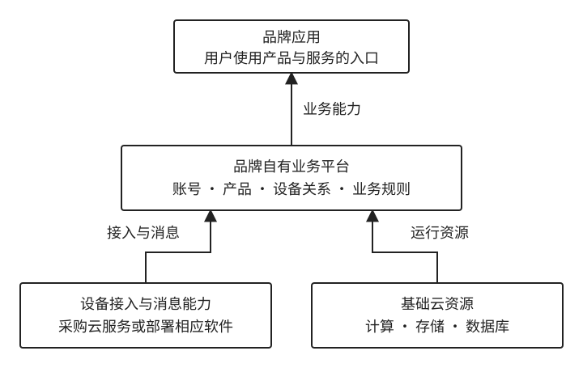

# 1.4 同样叫 IoT 平台，提供的究竟是什么

[返回第 1 章：IoT 世界地图](../01-iot-world.md)

上一节比较了单设备、设备套装、场景产品、行业解决方案和开放生态。产品形态一旦扩大，背后需要管理的设备、用户、空间、规则和合作关系也会增加。现在把视线集中到“IoT 平台”这个常被混用的词：它可能是品牌自己的业务体系，也可能是外部云服务、可部署的软件，或者连接产品与开发者的生态入口。

本节先解释品牌为什么建设共同平台，再区分连接、平台和应用服务，最后用几个现实产品说明不同平台的业务位置。合作模式、费用和服务长期变化带来的责任，留到下一节讨论。

## 1.4.1 品牌企业为什么也在建设 IoT 平台

智能设备卖出去以后，品牌与用户的关系通常还没有结束。

一盏智能灯、一台扫地机器人或一台婴儿监护器，用户可能会连续使用很多年。在这期间，品牌不仅要保证设备能够正常工作，还要持续提供设备添加、账号登录、家庭成员共享、远程控制、自动化场景、软件升级和故障诊断等服务。

这也是越来越多硬件品牌开始建设 IoT 平台的重要原因。

### 产品增多以后，共性能力需要被复用

假设一家品牌最初只做一款智能灯。为了让用户控制它，企业需要开发 App、账号系统、设备连接、远程控制和软件升级等功能。

第二年推出智能插座，第三年又推出传感器和摄像头。如果每个产品团队都从头建设一套系统，就很容易出现这样的局面：不同产品使用不同账号，设备添加方式不一样，App 体验不一致，后台系统也彼此独立。

对用户来说，这会造成体验割裂；对企业来说，则意味着重复开发、重复运维，以及更高的长期维护成本。

因此，当产品逐渐增多时，企业通常会把反复需要的能力抽取出来，形成共同的平台，例如：

- 统一管理用户账号、家庭和成员权限；
- 统一管理设备、连接与消息；
- 统一提供软件升级、日志和故障诊断；
- 统一支持房间、场景和自动化规则。

新产品接入这套平台后，就不必重新建设全部基础能力。**对品牌企业来说，建设 IoT 平台的一个重要目的，就是让不同产品共享同一套数字基础设施。**

### 面向消费者的品牌，也可以是平台运营者

平台建成以后，一家消费电子企业的身份会比表面上更复杂。它可能既是硬件产品的设计者和品牌方，也向消费者提供 App 与数字服务，还在后台持续运行设备平台。

这些身份并不冲突。“面向 C 端”说明企业最终服务的是消费者；“平台运营者”说明企业持续运行着一套支撑设备和服务的系统。

因此，**一家企业即使从不向其他公司出售 IoT 平台，也完全可以拥有并运营自己的 IoT 平台。**

### 美的：多品类企业为什么需要共同平台

美的是这一模式中比较容易理解的例子。它拥有空调、冰箱、洗衣机和厨房电器等多个品类。如果每个品类都采用完全独立的账号、App 和云端系统，用户体验与企业内部协作都会变得更加复杂。

美的公开介绍了美居应用，以及设备接入、设备管理、远程升级和用户运营等云平台能力；其开发者平台还提供模组、SDK 和云云对接等接入方式。对于这样的多品类企业，共同平台至少有两方面作用：一方面，它可以支撑内部不同产品团队，让新设备复用已有的账号、设备管理和云端能力；另一方面，它也可以成为连接外部设备、开发者和服务合作伙伴的入口。[美的云平台](https://msmart.midea.com/cloudPlatform)、[美的设备接入方式](https://iot.midea.com/docs/device-access-to-midea-cloud/access-mode.html)

### 用户看到的，往往是 App 与持续服务

用户通常不会直接看到后台的 IoT 平台。他们真正接触到的，是 App、设备控制界面、消息通知、远程服务和软件升级。

追觅是一个直观的例子。用户购买扫地机器人等设备后，可以通过 Dreamehome 添加设备、查看状态并进行清洁控制。

这些产品体现了一个重要变化：**消费者买到的不再只是硬件，而是“硬件 + App + 持续在线服务”的组合。**[追觅应用说明](https://ae.dreametech.com/pages/dreamehome-app-download)

不过，这里需要注意证据的边界。从 App 和产品功能中，可以判断企业正在向用户提供持续的数字服务，但不能仅凭这些公开现象认定后台系统全部由企业自己开发，也不能据此判断它具体采用了哪一家云服务商。

### 平台怎样支撑产品业务

共同平台对产品业务的支撑，主要体现在四个方面：

- **统一用户体验。** 多个设备使用同一账号、同一个 App 和相似的操作方式，用户购买第二个、第三个产品时，学习与使用成本会更低。
- **提高研发复用效率。** 账号、设备连接、消息、升级和日志等能力不需要由不同团队反复开发，新产品可以更快接入已有体系。
- **支持长期维护。** 设备售出后，企业仍要处理软件升级、安全修复、故障诊断和售后服务，统一平台能让这些工作更加集中、可管理。
- **掌握产品演进节奏。** 当账号体系、设备模型、业务规则和关键接口由品牌自己组织时，企业可以更主动地根据产品策略调整功能。

因此，平台带来的回报可能体现为产品竞争力、研发效率、用户留存、售后效率和新的增值服务，并不一定单独体现为“平台收入”。

### 自有平台与全栈自研不是一回事

品牌企业可以组织和运营自己的账号、设备模型、产品逻辑与业务服务，同时采购公有云、连接服务或平台软件。判断它是否拥有自有平台，关键在于谁组织业务能力、掌握核心数据和产品逻辑，而不是谁写了每一行代码。平台的交付方式与许可方式将在 1.4.3 集中区分。

## 1.4.2 连接、平台与应用：谁提供持续运行的服务

智能设备卖出去以后，许多服务仍然需要持续运行。设备要能够联网，后台要能够识别和管理设备，用户还要通过 App、网页或控制面板真正使用这些能力。

可以把这部分工作暂时分成三个层次：**连接服务解决“设备怎样连上网络”，平台服务解决“设备怎样被后台管理”，应用服务解决“这些能力怎样变成用户真正使用的功能”。** 三者可能由不同企业分别提供，也可能由同一家供应商一起承担。

### 连接服务：让设备能够把数据传出去

设备首先需要一条通信通道。

家庭中的智能灯、插座和摄像头通常使用住户已有的 Wi-Fi 与宽带，品牌一般不需要为每台设备单独购买互联网连接。但共享设备、车载终端、物流追踪器和户外监测设备分布在不同地点，往往需要通过蜂窝网络联网。这时，设备可能使用物联网卡和相应的通信套餐，费用则可能由设备企业、运营服务商或最终客户承担。

当终端数量达到几千甚至几十万台时，企业管理的就不只是“有没有网络”，还包括哪些卡正在使用、哪些设备已经停机、每台设备消耗了多少流量、通信费用是多少，以及是否需要调整套餐或连接状态。

中国移动的物联卡连接管理服务可以作为参照。它提供通信状态、资费账务和连接管理等能力，帮助企业管理大量终端使用的蜂窝连接。[中国移动物联卡连接管理平台](https://ec.iot.10086.cn/)

这里管理的主要是**网络连接本身**。连接管理系统可以知道一张卡是否在线、使用了多少流量，却不会因此知道设备属于哪个家庭、哪些用户拥有控制权限，或者用户配置了什么自动化场景。这些问题需要由更上层的平台和业务系统处理。

### 平台服务：让企业能够管理大量设备

设备能够联网以后，还需要解决另一个问题：**后台怎样识别设备、了解设备状态，并把指令发送给正确的设备？**

IoT 平台通常会提供设备接入、身份认证、状态管理、消息处理、远程控制、软件升级、日志和告警等共同能力。

例如，一盏智能灯可以向后台报告“当前处于开启状态，亮度为 60%”。用户在外地点击 App 中的“关灯”后，系统又需要找到对应设备，验证用户是否有权控制，再把指令发送出去。一个看似简单的远程操作，背后需要设备、网络和云端系统持续配合。

对于晴川这样的品牌企业，这些能力可以全部自行建设，也可以采购外部平台服务，或者只采购其中一部分。采用成熟服务能够减少基础系统的重复建设，让团队把更多研发投入放在灯具功能和用户体验上；但供应商承担的范围越大，品牌需要自行建设的内容通常越少，对外部接口和服务延续性的依赖也可能越深。

### 应用服务：把设备能力变成产品功能

平台能够识别和管理设备，并不意味着用户已经获得了一个完整的产品。用户真正接触到的，通常是 App、网页、控制面板和其中的具体功能。

不同产品会把相似的设备与平台能力组织成完全不同的应用：

- 智能灯应用围绕开关、调光、定时、房间和场景联动设计；
- 扫地机器人应用提供地图、清扫区域和任务计划；
- 楼宇应用则围绕空间、设备状态、能耗、告警和维护安排功能。

因此，**应用层负责把设备和平台提供的基础能力，组织成具体的使用方式和业务流程。**

应用开发也不一定全部由品牌自行完成。它可以由品牌内部团队负责，也可以委托软件公司开发，还可以采用平台供应商提供的应用框架，再进行品牌化和定制。

涂鸦就是服务范围跨越多个层次的例子。除了设备接入和云端能力，它还提供 OEM App、App SDK 等产品。品牌可以较快配置自己的品牌应用，也可以基于 SDK 开发定制程度更高的 App。这说明供应商提供的能力可以从“让设备接入云端”，继续延伸到“帮助品牌把用户应用做出来”。[涂鸦开发者平台](https://developer.tuya.com/cn/)、[涂鸦 OEM App](https://www.tuya.com/cn/platform/appdev/oemapp)

### 三层服务解决的是不同问题

把三者放在一起，区别会更加清楚：

- **连接服务：**让设备能够接入网络并传输数据；
- **平台服务：**让企业能够识别、管理和控制大量设备；
- **应用服务：**让消费者或业务人员能够使用设备完成具体任务。

例如，一台户外监测设备可以通过蜂窝网络连接互联网，通过 IoT 平台向后台报告状态，最后再由 App 或管理系统把数据转化为图表、告警和业务操作。任何一层缺失，最终服务都可能无法完整运行。

这三个层次并不是三种固定的企业类型。通信运营商可以向上提供连接管理与设备服务，平台供应商可以继续提供 App 开发工具，大型品牌也可能自行承担其中的大部分工作。

因此，认识一家 IoT 服务企业时，真正值得问的不是“它究竟属于连接公司、平台公司还是软件公司”，而是：

- 它替客户完成了哪一部分持续运行的工作？
- 它的能力覆盖到哪一层？
- 剩下哪些工作仍需要客户或其他合作伙伴完成？

**设备能够联网只是起点。真正让它在多年时间里持续可用，需要连接、平台和应用共同运行。** 也正因为供应商可能覆盖其中不同范围，下一节还需要进一步辨认：同样被称为“IoT 平台”的产品，实际提供的究竟是什么。

## 1.4.3 几种平台处在不同的业务位置

前面多次提到“IoT 平台”，但这个词覆盖的范围很宽，也很容易引起误解。

例如，一家品牌企业可以说自己建设了 IoT 平台，同时又使用 AWS IoT、阿里云或其他外部服务。这两件事并不矛盾，因为它们回答的不是同一个问题：

- **“建设自己的 IoT 平台”**，说的是面向产品和用户的业务体系由谁组织和运营；
- **“使用 AWS IoT 等外部服务”**，说的是建设这套体系时采购了哪些技术能力。

这就像一家电商企业可以运营自己的商城，但商城使用的服务器、数据库和支付服务不必全部由自己开发。因此，如果把“自建平台”“云平台”和“开源平台”简单列成三个互相排斥的选项，就会把业务归属、交付方式和软件许可等不同维度混在一起。

### 看一个“平台”，先问四个问题

面对名称各异的 IoT 平台，与其急着给它们分类，不如依次问四个问题。

**第一，谁在使用它？**

有的平台主要服务企业内部的产品团队，有的面向其他品牌和设备厂商，还有的平台希望连接开发者、服务商和生态合作伙伴。服务对象不同，平台需要解决的问题也会不同。

**第二，它提供到哪一层能力？**

有些产品主要解决设备连接和消息传递；有些进一步提供设备管理、软件升级、数据处理和规则引擎；还有一些继续向上延伸，提供 App 开发、用户管理、场景联动乃至运营工具。“都叫 IoT 平台”并不意味着它们交付的是同一种能力。

**第三，它怎样交付和运行？**

有的平台由供应商负责运行，客户通过互联网直接使用，通常称为托管服务；有的软件可以安装在企业自己的服务器或云环境中，由企业自行运行。同一个产品也可能同时提供两种交付方式。

**第四，它采用什么许可方式？**

开源描述的是代码开放范围和软件许可，并不直接回答平台由谁运营。开源软件可以由企业自行部署，也可以被供应商包装成托管服务；闭源软件同样可能部署在客户自己的环境中。

所以，**业务平台是自有还是外部、系统是托管还是自行部署、软件是开源还是闭源，是几个需要分别回答的问题。**

### 几种“平台”处在不同的业务位置

下面这些产品经常同时出现在 IoT 讨论中，但它们服务的对象、覆盖的能力和交付方式并不完全相同。

表 1-3 几种被称为“平台”的供给及其业务位置。表中的比较用于说明侧重点，不表示它们互相排斥，也不是功能完整度排名。

| 对象 | 主要服务对象 | 主要提供什么 | 采用方通常还要做什么 |
| --- | --- | --- | --- |
| 品牌自有平台，如美的 IoT | 企业内部产品团队、消费者及合作伙伴 | 围绕本品牌设备组织账号、设备、应用和业务体系 | 持续进行产品开发、用户服务和平台运营 |
| AWS IoT Core、阿里云物联网平台 | 设备企业和开发团队 | 设备连接、消息和设备管理等基础云能力 | 建设产品业务、用户体系、应用和系统集成 |
| 涂鸦开发者平台 | 品牌、制造商和开发者 | 从设备接入、云端服务到 App 开发等较完整的能力 | 完成产品定义及平台覆盖范围之外的定制工作 |
| 小米 IoT 与米家生态 | 设备合作伙伴、开发者和消费者 | 产品接入、生态规则以及共同的用户入口 | 完成设备研发、生态适配和后续产品服务 |
| ThingsBoard | 自建平台和行业应用团队 | 可部署的平台软件及云服务 | 完成业务配置、系统集成，并承担相应部署和运维 |
| EMQX | 设备接入和数据系统建设团队 | MQTT 消息接入、消息传递和数据集成 | 建设用户、产品、应用及更上层的业务体系 |

这张表最重要的不是记住每一行，而是看到一个事实：**“平台”可能指基础云能力、产品开发体系、生态入口，也可能指一套可部署的软件或其中某一层基础设施。**

### AWS IoT 和阿里云：为企业平台提供基础能力

AWS IoT Core 提供托管的设备连接、消息和相关数据处理能力。阿里云物联网平台的公开文档也介绍了设备连接、物模型、消息流转和设备管理等能力。企业可以使用这些服务，把设备接入与消息基础设施建立在外部云服务之上。

但是，这些能力不会自动变成一个完整的智能家居产品。一个家庭有哪些成员、谁能控制设备、用户购买了哪些商品、保修期如何计算、App 首页展示什么，仍然需要由品牌自己的产品与业务系统处理。

因此，一家企业完全可以在上层运营自己的 IoT 业务平台，同时在底层使用 AWS IoT、阿里云或其他供应商提供的部分能力。这里比较的是能力位置；具体产品是否可用以及适用的地域、版本和服务范围，仍应以采用时的官方说明为准。[AWS IoT Core](https://aws.amazon.com/iot-core/)、[阿里云物联网平台文档](https://help.aliyun.com/zh/iot/)

### 涂鸦：把服务范围延伸到产品开发

涂鸦提供的范围比单纯的设备连接与消息服务更靠近产品开发。除了设备接入和云端能力，它还提供 OEM App、App SDK 和其他开发工具，使品牌能够选择由平台承担更多设备、云端与应用建设工作。

例如，同样准备推出一款智能灯，品牌可以只采购底层连接能力，自己开发后台和 App；也可以采用覆盖范围更广的平台服务，从设备接入一直使用到 App 开发工具。两种方式都能形成品牌自己的产品，区别在于品牌与供应商之间如何划分工作。[涂鸦开发者平台](https://developer.tuya.com/cn/)、[涂鸦 OEM App](https://www.tuya.com/cn/platform/appdev/oemapp)

### 小米 IoT：平台也可以成为生态入口

有些平台不仅提供技术能力，也组织产品进入某个生态体系。小米 IoT 开发者平台展示了设备厂商进行产品开发、接入、认证和发布的路径，并让设备进入米家等共同的用户入口。

在这里，平台不仅解决技术接入问题，还通过规则、认证和使用入口连接设备企业、开发者、合作伙伴与消费者。**设备进入同一个生态，并不意味着它们由同一家企业生产，也不意味着它们属于同一个品牌。**[小米 IoT 开发者平台](https://iot.mi.com/)

### ThingsBoard：平台也可以是一套软件

ThingsBoard 展示了另一种形态：它提供可以自行部署的平台软件，也提供云服务。企业采用这类产品，不必从零编写所有平台能力，但仍然需要决定软件运行在哪里，以及由谁负责长期运行。

如果选择自行部署，采用方通常还要处理服务器环境、升级、备份、监控和运维；如果选择托管服务，一部分基础运行工作则由供应商承担。因此，**使用现成的平台软件，不等于已经有人替企业运营整套平台。**[ThingsBoard 文档](https://thingsboard.io/docs/)

### EMQX：有些产品只解决平台中的一层

EMQX 可以帮助理解另一个容易混淆的问题：有些能力对 IoT 系统非常重要，但只覆盖其中一层。

EMQX 的核心位置是 MQTT 消息与设备数据接入。MQTT 可以暂时理解为设备交换消息的一套通信约定，具体技术将在 1.6 节展开。设备可以通过消息报告“当前温度是 26℃”，平台也可以向设备发送“关闭灯光”的指令。EMQX 可以帮助大量设备建立连接、传递消息，并把数据送往其他系统。

但是，消息系统并不会因此自动知道设备属于哪个用户、家庭成员拥有什么权限、设备是否在保修期，或者售后工单应该交给谁处理。这些仍属于更上层的产品与业务系统。**设备能够连接和传递消息，只说明一部分基础能力已经具备，并不意味着完整的 IoT 产品平台已经建成。**[EMQX 产品与交付说明](https://www.emqx.com/en/blog/adopting-business-source-license-to-accelerate-mqtt-and-ai-innovation)

### 回到晴川：自有业务平台可以建立在外部能力之上

回到前面的晴川智能灯。晴川可以由自己的团队运营用户账号、家庭关系、产品逻辑、App 和售后体系，同时在底层采购云计算资源、设备连接服务、消息软件或其他技术组件。

因此，更接近现实的结构往往不是：

**自建平台，或者第三方平台。**

而是：

**自己的业务平台，加上若干外部技术能力。**

外部供应商参与到哪一层，取决于企业希望掌握哪些能力，以及愿意为哪些工作持续投入团队和资源。

图 1-2 企业自有平台与外部服务可以同时存在。品牌负责组织自己的产品与业务体系，同时可以在不同层次采购外部能力。箭头表示能力供给方向；图中的候选服务只是示意，并不表示企业必须同时采用所有产品。

**平台由谁运营，与底层技术由谁提供，是两个需要分别回答的问题。** 采购成熟能力可以减少部分开发和运维工作，同时也要适应供应商的接口、服务范围与后续变化；自行建设则能扩大技术选择和功能调整的空间，但需要持续投入研发与运维资源。

所以，在讨论“自建还是采购”之前，首先应该问清楚：**企业真正希望掌握哪一层能力，又准备把哪些工作交给外部供应商。**

把平台放回具体企业和产品之后，可以继续追问：企业怎样划分自建与采购的范围，供应商变化时又由谁承担迁移和维护工作。下一节将讨论这些合作模式与长期责任。
